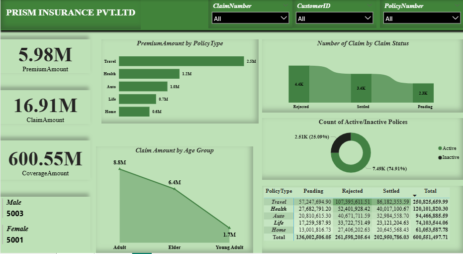

**Insurance-Claims-Analysis-Dashboard:**

A Power BI dashboard analyzing insurance policy and claims data for a fictional company, Prism Insurance Pvt Ltd.

Project Overview:
This project was built as part of a Power BI learning course, using a provided insurance dataset to practice real-world dashboard design and analysis. The dashboard tracks key insurance metrics including premium amounts, claim amounts, and coverage amounts, and breaks these down by policy type, claim status, and customer age group. It also highlights the split between active and inactive policies. The Power BI file includes an additional practice page beyond the main dashboard shown below.

Tools Used:
The raw insurance dataset was loaded and modeled in Power BI, where the data was cleaned and structured to build an interactive dashboard covering premiums, claims, and policy activity.

Key Insights:
Total Premium Amount collected was 5.98M, while Total Claim Amount was 16.91M, against a Total Coverage Amount of 600.55M. Travel policies generated the highest premium amount at 2.5M, followed by Health at 1.2M, Auto at 1.0M, Life at 0.7M, and Home at 0.6M. Looking at claim status, 4.4K claims were rejected, 3.4K were settled, and 2.3K are still pending. Claim amount decreases across age groups, with Adults filing the highest claims at 8.8M, followed by Elders at 6.4M, and Young Adults the lowest at 1.7M. Of all policies, 74.91 percent are active and 25.09 percent are inactive. Across policy types, Travel had the highest total claim value at 250,825,659.99, while Home had the lowest at 61,053,587.78. The customer base is nearly even between male and female policyholders, with 5003 male and 5001 female customers. This repository includes the raw insurance dataset, the Power BI dashboard file, and a preview image of the dashboard.

Dashboard Preview:

How to Use:
Clone or download this repository, then open the Power BI file in Power BI Desktop to explore the interactive dashboard.
